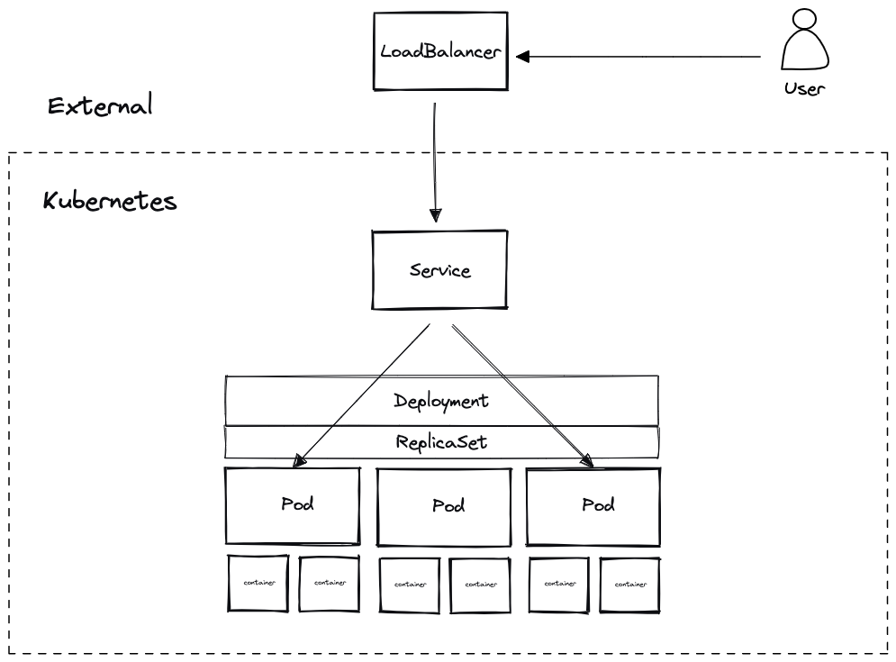

## Kubernetes Components

Documentation: <https://kubernetes.io/docs/concepts/overview/components/>

### kube-api-server

kube-api-server is the front end for the Kubernetes control plane.

### etcd

Consistent and highly-available key value store used as Kubernetes' backing store for all cluster data.

### kube-scheduler

Control plane component that watches for newly created Pods with no assigned node, and selects a node for them to run on.

### kube-controller-manager

Control plane component that runs controller processes.

### kubelet

An agent that runs on each node in the cluster. It makes sure that containers are running in a Pod.

### kube-proxy

kube-proxy is a network proxy that runs on each node in your cluster, implementing part of the Kubernetes Service concept.

## Reconciliation

## Example container

